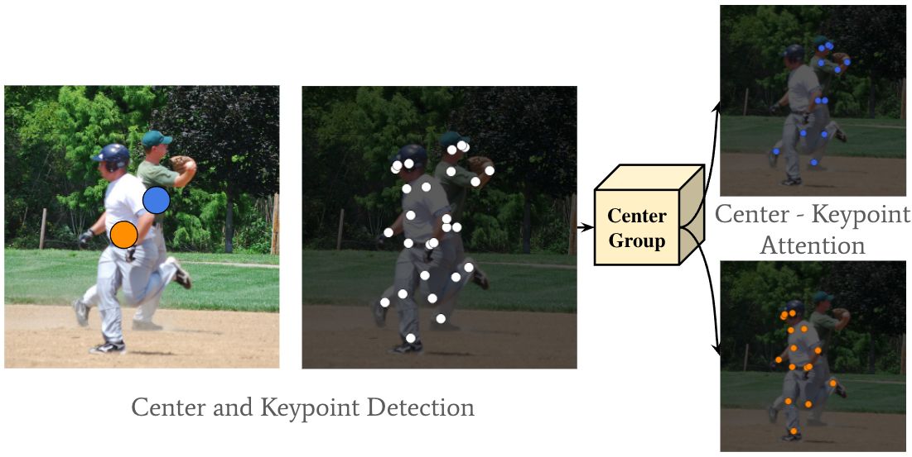

# CenterGroup

This the official implementation of our **ICCV 2021** paper 

> [**The Center of Attention: Center-Keypoint Grouping via Attention for Multi-Person Pose Estimation**](https://arxiv.org/abs/2110.05132),            
> 
> [Guillem Brasó](https://dvl.in.tum.de/team/braso/), [Nikita Kister](), [Laura Leal-Taixé](https://dvl.in.tum.de/team/lealtaixe/)        
> We introduce CenterGroup, an attention-based framework to estimate human poses from a set of identity-agnostic keypoints and person center predictions in an image. Our approach uses a transformer to obtain context-aware embeddings for all detected keypoints and centers and then applies multi-head attention to directly group joints into their corresponding person centers. While most bottom-up methods rely on non-learnable clustering at inference, CenterGroup uses a fully differentiable attention mechanism that we train end-to-end together with our keypoint detector. As a result, our method obtains state-of-the-art performance with up to 2.5x faster inference time than competing bottom-up methods. 

    @article{Braso_2021_ICCV,
        author    = {Bras\'o, Guillem and Kister, Nikita and Leal-Taix\'e, Laura},
        title     = {The Center of Attention: Center-Keypoint Grouping via Attention for Multi-Person Pose Estimation},
        journal = {ICCV},
        year      = {2021}
    }

## Main Results
With the code contained in this repo, you should be able to reproduce the following results. 
### Results on COCO val2017
| Method| Detector |Multi-Scale Test| Input size |     AP | AP.5 | AP .75 | AP (M) | AP (L) |
|----------|----------|:------------:|------------|-------|-------|--------|--------|--------| 
| CenterGroup| HigherHRNet-w32  |&#10008;| 512         | 69.0  | 87.7  |  74.4  |  59.9  |  75.3  | 
| CenterGroup| HigherHRNet-w48  |&#10008;| 640         | 71.0  | 88.7  |  76.5  |  63.1  |  75.2  | 
| CenterGroup| HigherHRNet-w32  | &#10004;| 512        | 71.9  | 89.0  |  78.0  |  63.7  |  77.4  | 
| CenterGroup| HigherHRNet-w48  | &#10004;| 640        | 73.3  | 89.7  |  79.2  |  66.4  |  76.7  | 

### Results on COCO test2017 
| Method| Detector |Multi-Scale Test| Input size |     AP | AP .5 | AP .75 | AP (M) | AP (L) |
|----------|----------|:------------:|------------|-------|-------|--------|--------|--------| 
| CenterGroup| HigherHRNet-w32  |&#10008;| 512         | 67.6  | 88.6  |  73.6  |  62.0  |  75.6  | 
| CenterGroup| HigherHRNet-w48  |&#10008;| 640         | 69.5  | 89.7  |  76.0  |  65.0  |  76.2  | 
| CenterGroup| HigherHRNet-w32  | &#10004;| 512        | 70.3  | 90.0 | 76.9  | 65.4  |  77.5  | 
| CenterGroup| HigherHRNet-w48  | &#10004;| 640        | 71.4  | 90.5  |  78.1  |  67.2  |  77.5  |     

### Results on CrowdPose test
| Method| Detector |Multi-Scale Test| Input size |     AP | AP .5 | AP .75 | AP (E) | AP (M) | AP (H) |
|----------|----------|:------------:|------------|-------|-------|--------|--------|--------| --------| 
| CenterGroup| HigherHRNet-w48  |&#10008;| 640         | 67.6  | 87.6  |  72.7  | 74.2  |  68.1  | 61.1  | 
| CenterGroup| HigherHRNet-w48  | &#10004;| 640        | 70.3  | 89.1  |  75.7  |  77.3  |  70.8  |  63.2  |

## Installation
Please see [docs/INSTALL.md](docs/INSTALL.md)
## Model Zoo
Please see [docs/MODEL_ZOO.md](docs/MODEL_ZOO.md)
## Evaluation
To evaluate a model you have to specify its configuration file, its checkpoint, and the number of GPUs you want to use. All of our configurations and checkpoints are available [here](docs/MODEL_ZOO.md)) For example, to run CenterGroup with a HigherHRNet32 detector and a single GPU you can run the following:
```
NUM_GPUS=1
./tools/dist_test.sh configs/centergroup/coco/higherhrnet_w32_coco_512x512.py models/centergroup/centergroup_higherhrnet_w32_coco_512x512.pth $NUM_GPUS 1234
```
If you want to use multi-scale testing, please add the `--multi-scale` flag, e.g.:
```
./tools/dist_test.sh configs/centergroup/coco/higherhrnet_w32_coco_512x512.py models/centergroup/centergroup_higherhrnet_w32_coco_512x512.pth $NUM_GPUS 1234 --multi-scale
```
You can also modify any other config entry with the `--cfg-options` entry. For example, to disable flip-testing, which is used by default, you can run:
```
./tools/dist_test.sh configs/centergroup/coco/higherhrnet_w32_coco_512x512.py models/centergroup/centergroup_higherhrnet_w32_coco_512x512.pth $NUM_GPUS 1234 --cfg-options model.test_cfg.flip_test=False
```
You may need to modify the checkpoint's path, depending on where you downloaded it, and the entry `data_root` in the config file, depending on where you stored your data.


## Training HigherHRNet with Centers
**TODO**
## Training CenterGroup
To train a model, you have to specify its configuration file and the number of GPUs you want to use. You can optionally specify the path where you want your output checkpoint and log files to be stored, as well as the identifier for this training. For example, to train CenterGroup on COCO with a HigherHRNet w32 backbone and on two GPUs with batch size you can run the following: 
```
python tools/train.py --cfg configs/coco/centergroup/coco/higherhrnet_w32_coco_512x512.py --num_gpus 2 --out output --run_str my_training 
```
As with evaluation, you can use the `--cfg-options` entry to modify any configuration. For instance, to use batch size 24 (per GPU) run:
```
python tools/train.py --cfg configs/coco/centergroup/coco/higherhrnet_w32_coco_512x512.py --num_gpus 2 --out output --run_str my_training --cfg-options data.samples_per_gpu=24
```

Note: the code does not support evaluation after every epoch yet due to distributed training issues. Moreover, training on CrowdPose is not supported yet. Both features will be released very soon!

## Demo
**TODO**
## Acknowledgements
Our code is based on [mmpose](https://github.com/open-mmlab/mmpose), which reimplemented [HigherHRNet](https://github.com/HRNet/HigherHRNet-Human-Pose-Estimation)'s work. We thank the authors of these codebases for their great work!

